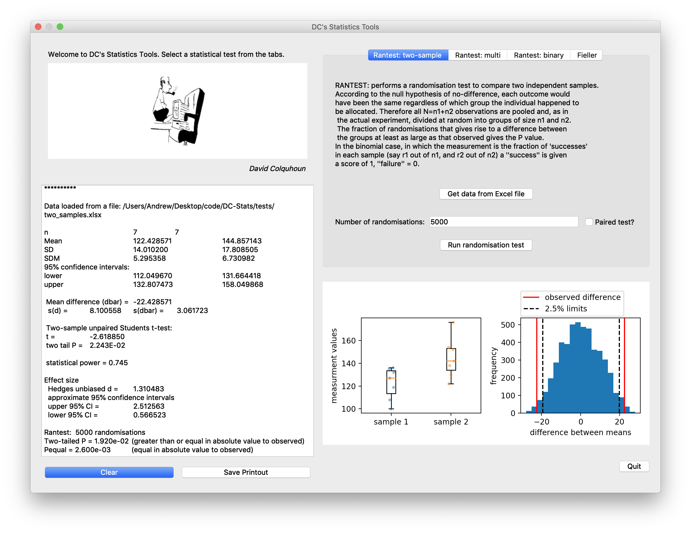

# DC Stats
Python port and extension of David Colquhoun's Statistics Tools

Work porting to Python from original FORTRAN was begun by Remigijus Lape at UCL. 

Qt5 GUI under Python 3.8 is now the preferred environment. 
Dependencies are: pandas, numpy and scipy. Note openpyxl is also needed if you want to open .xlsx files. 
You can get everything you need on any platform with Anaconda or miniconda.

We tested DC_stats on macOS up to 11.6 (BigSur) and Windows. Linux should also be fine. 

If you work with Python version 2.7 (as packaged with macOS), you will get the Tkinter GUI that is no longer maintained. This version should work with old versions of OSX like 10.6 though. However, as even Andrew has now gone over to Python 3, you ought to as well. Step-by-step instructions are included below. 

Examples of how to use modules are provided in Jupyter notebooks (.ipynb files). 

To run, open the Terminal (Mac/Linux) or cmd.exe (Windows), navigate to the DC-Stats directory and type:

`python DC_Stats.py`

You can do a randomization test on continuous or binomial data, and look at Fiellers theorem for the standard deviation of a ratio too. For continuous randomization test, information about effect size (Hedges' unbiased d and its approximate confidence interval from bootstrap) is also included in the output. 

To use data from Excel, save the two sets of values in two columns as tab-delimited text without titles. You should be able to choose which sheet to use from a multi-sheet .xlsx file. 

## Installation

Straightforward installation can be achieved with miniconda at the Terminal. 

Get a recent version of miniconda from the following site:
https://docs.conda.io/projects/conda/en/latest/user-guide/install/download.html#

Create a blank working environment for DC-Stats: 
`conda create --name DC-stats`

Switch to this environment:
`conda activate DC-Stats`

Then it is convenient to issue 
`pip install python==3.8`

which will install python 3.8 purely in this environment. A blank canvas. pip is also installed by this command (but not other things we need). 

Download the DC-Stats folder from this page and navigate to it. Then the `dcstats` package can be installed locally with all the needed dependent packages (note the space and a dot at the end):

`pip install .`

or

`pip install -e .`

The latter command creates symlink which allows any source code change be available locally immediately.

In future, when you want to run DC-Stats, open the Terminal and issue:

`conda activate DC-Stats
python DC_stats.py`

# Projected ongoing development
This software is under development. Output is not fully tested, and therefore you should exercise caution if you plan to use the results for production / publication. 

Batch processing of data is now implemented for Rantest. Intuitive import and export should follow.

